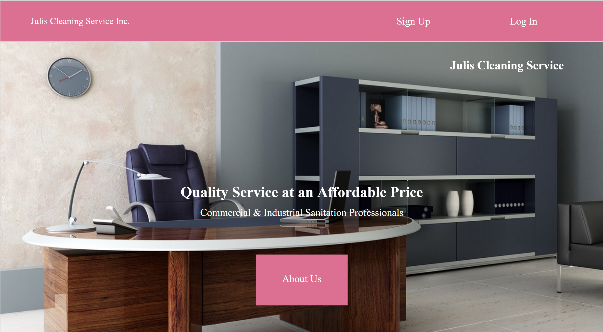
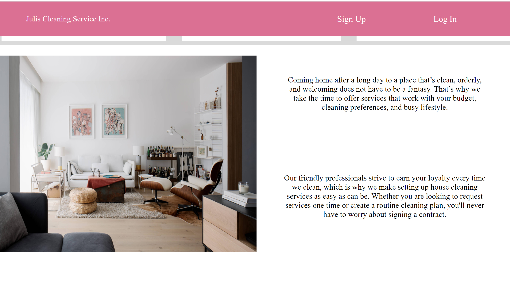
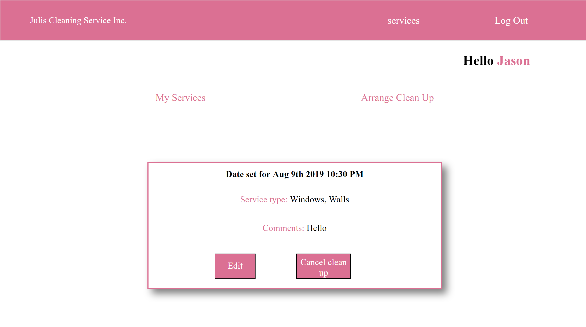
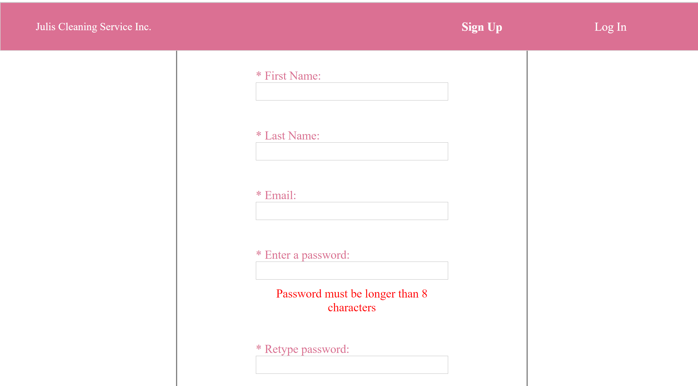

This project was bootstrapped with [Create React App](https://github.com/facebook/create-react-app).

## Available Scripts

In the project directory, you can run:

### `npm install`

Install the project's dependencies

### `npm start`

Runs the app in the development mode. 
Open [http://localhost:3000](http://localhost:3000) to view it in the browser.

The page will reload if you make edits. 
You will also see any lint errors in the console.

### `npm test`

Launches the test runner in the interactive watch mode. 
See the section about [running tests](https://facebook.github.io/create-react-app/docs/running-tests) for more information.

### `npm run build`

Builds the app for production to the `build` folder. 
It correctly bundles React in production mode and optimizes the build for the best performance.

The build is minified and the filenames include the hashes. 
Your app is ready to be deployed!

See the section about [deployment](https://facebook.github.io/create-react-app/docs/deployment) for more information.

### Deployment

This section has moved here: https://facebook.github.io/create-react-app/docs/deployment
# Julis cleaning service
## Live app: https://jason-juliscleaning-app.jasoncarcamo30.now.sh/
#### A full-stack website created for a cleaning company.  

 

 

 
 

## Summary
The starting template used to create a full stack website for a cleaning company. Features include endpoints for creating user accounts and complete control of creating, editing, and deleting services.

## For demo purposes you can use this account:
  Mobile number: 11 
  Password: Password11! (case-sensitive) 

## Built with
- Html
- Css
- React.js
- TDD with mocha, Jest, and Enzyme

## API repository
https://github.com/jasoncarcamo/julis-api
